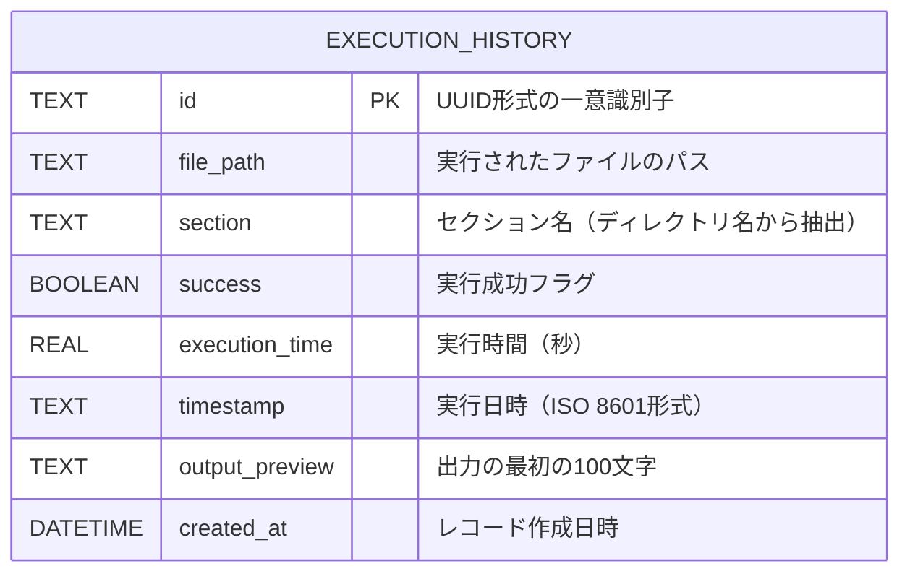
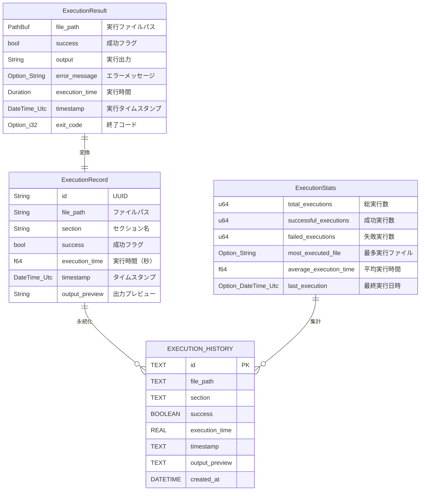
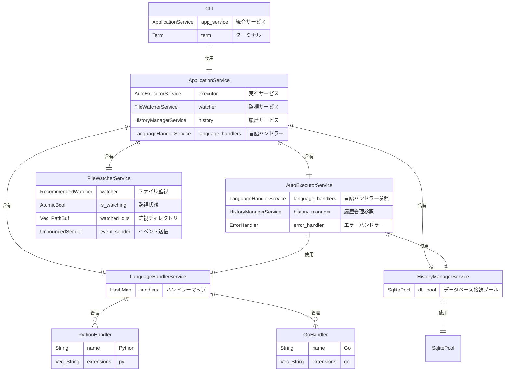
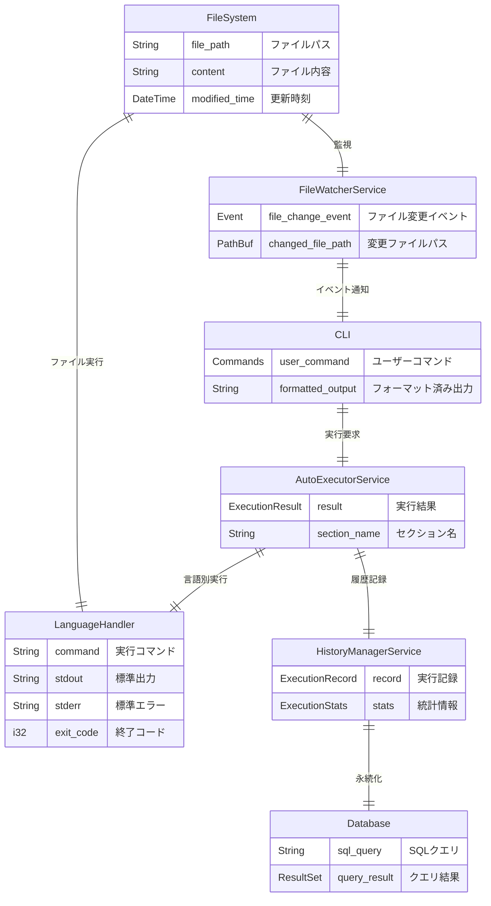
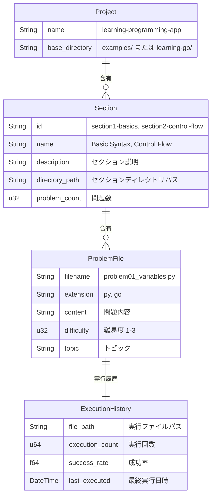
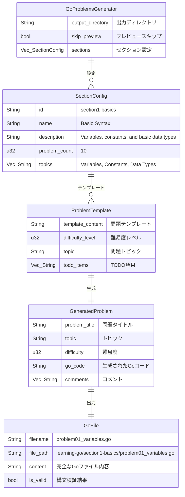

# ER図（Entity Relationship Diagram）

## データベース構造

```mermaid
erDiagram
    EXECUTION_HISTORY {
        TEXT id PK "UUID形式の一意識別子"
        TEXT file_path "実行されたファイルのパス"
        TEXT section "セクション名（ディレクトリ名から抽出）"
        BOOLEAN success "実行成功フラグ"
        REAL execution_time "実行時間（秒）"
        TEXT timestamp "実行日時（ISO 8601形式）"
        TEXT output_preview "出力の最初の100文字"
        DATETIME created_at "レコード作成日時"
    }
```

## データモデル関係図

```mermaid
erDiagram
    ExecutionResult ||--|| ExecutionRecord : "変換"
    ExecutionRecord ||--o{ EXECUTION_HISTORY : "永続化"
    ExecutionStats ||--o{ EXECUTION_HISTORY : "集計"
    
    ExecutionResult {
        PathBuf file_path "実行ファイルパス"
        bool success "成功フラグ"
        String output "実行出力"
        Option_String error_message "エラーメッセージ"
        Duration execution_time "実行時間"
        DateTime_Utc timestamp "実行タイムスタンプ"
        Option_i32 exit_code "終了コード"
    }
    
    ExecutionRecord {
        String id "UUID"
        String file_path "ファイルパス"
        String section "セクション名"
        bool success "成功フラグ"
        f64 execution_time "実行時間（秒）"
        DateTime_Utc timestamp "タイムスタンプ"
        String output_preview "出力プレビュー"
    }
    
    ExecutionStats {
        u64 total_executions "総実行数"
        u64 successful_executions "成功実行数"
        u64 failed_executions "失敗実行数"
        Option_String most_executed_file "最多実行ファイル"
        f64 average_execution_time "平均実行時間"
        Option_DateTime_Utc last_execution "最終実行日時"
    }
    
    EXECUTION_HISTORY {
        TEXT id PK
        TEXT file_path
        TEXT section
        BOOLEAN success
        REAL execution_time
        TEXT timestamp
        TEXT output_preview
        DATETIME created_at
    }
```

## アプリケーションアーキテクチャ図

```mermaid
erDiagram
    CLI ||--|| ApplicationService : "使用"
    ApplicationService ||--|| AutoExecutorService : "含有"
    ApplicationService ||--|| FileWatcherService : "含有"
    ApplicationService ||--|| HistoryManagerService : "含有"
    ApplicationService ||--|| LanguageHandlerService : "含有"
    
    AutoExecutorService ||--|| LanguageHandlerService : "使用"
    AutoExecutorService ||--|| HistoryManagerService : "使用"
    
    LanguageHandlerService ||--o{ PythonHandler : "管理"
    LanguageHandlerService ||--o{ GoHandler : "管理"
    
    HistoryManagerService ||--|| SqlitePool : "使用"
    
    CLI {
        ApplicationService app_service "統合サービス"
        Term term "ターミナル"
    }
    
    ApplicationService {
        AutoExecutorService executor "実行サービス"
        FileWatcherService watcher "監視サービス"
        HistoryManagerService history "履歴サービス"
        LanguageHandlerService language_handlers "言語ハンドラー"
    }
    
    AutoExecutorService {
        LanguageHandlerService language_handlers "言語ハンドラー参照"
        HistoryManagerService history_manager "履歴管理参照"
        ErrorHandler error_handler "エラーハンドラー"
    }
    
    FileWatcherService {
        RecommendedWatcher watcher "ファイル監視"
        AtomicBool is_watching "監視状態"
        Vec_PathBuf watched_dirs "監視ディレクトリ"
        UnboundedSender event_sender "イベント送信"
    }
    
    HistoryManagerService {
        SqlitePool db_pool "データベース接続プール"
    }
    
    LanguageHandlerService {
        HashMap handlers "ハンドラーマップ"
    }
    
    PythonHandler {
        String name "Python"
        Vec_String extensions "py"
    }
    
    GoHandler {
        String name "Go"
        Vec_String extensions "go"
    }
```

## データフロー関係図

```mermaid
erDiagram
    FileSystem ||--|| FileWatcherService : "監視"
    FileWatcherService ||--|| CLI : "イベント通知"
    CLI ||--|| AutoExecutorService : "実行要求"
    AutoExecutorService ||--|| LanguageHandler : "言語別実行"
    LanguageHandler ||--|| FileSystem : "ファイル実行"
    AutoExecutorService ||--|| HistoryManagerService : "履歴記録"
    HistoryManagerService ||--|| Database : "永続化"
    
    FileSystem {
        String file_path "ファイルパス"
        String content "ファイル内容"
        DateTime modified_time "更新時刻"
    }
    
    FileWatcherService {
        Event file_change_event "ファイル変更イベント"
        PathBuf changed_file_path "変更ファイルパス"
    }
    
    CLI {
        Commands user_command "ユーザーコマンド"
        String formatted_output "フォーマット済み出力"
    }
    
    AutoExecutorService {
        ExecutionResult result "実行結果"
        String section_name "セクション名"
    }
    
    LanguageHandler {
        String command "実行コマンド"
        String stdout "標準出力"
        String stderr "標準エラー"
        i32 exit_code "終了コード"
    }
    
    HistoryManagerService {
        ExecutionRecord record "実行記録"
        ExecutionStats stats "統計情報"
    }
    
    Database {
        String sql_query "SQLクエリ"
        ResultSet query_result "クエリ結果"
    }
```

## セクション・ファイル構造図

```mermaid
erDiagram
    Project ||--o{ Section : "含有"
    Section ||--o{ ProblemFile : "含有"
    ProblemFile ||--|| ExecutionHistory : "実行履歴"
    
    Project {
        String name "learning-programming-app"
        String base_directory "examples/ または learning-go/"
    }
    
    Section {
        String id "section1-basics, section2-control-flow"
        String name "Basic Syntax, Control Flow"
        String description "セクション説明"
        String directory_path "セクションディレクトリパス"
        u32 problem_count "問題数"
    }
    
    ProblemFile {
        String filename "problem01_variables.py"
        String extension "py, go"
        String content "問題内容"
        u32 difficulty "難易度 1-3"
        String topic "トピック"
    }
    
    ExecutionHistory {
        String file_path "実行ファイルパス"
        u64 execution_count "実行回数"
        f64 success_rate "成功率"
        DateTime last_executed "最終実行日時"
    }
```

## Go問題生成構造図

```mermaid
erDiagram
    GoProblemsGenerator ||--o{ SectionConfig : "設定"
    SectionConfig ||--o{ ProblemTemplate : "テンプレート"
    ProblemTemplate ||--|| GeneratedProblem : "生成"
    GeneratedProblem ||--|| GoFile : "出力"
    
    GoProblemsGenerator {
        String output_directory "出力ディレクトリ"
        bool skip_preview "プレビュースキップ"
        Vec_SectionConfig sections "セクション設定"
    }
    
    SectionConfig {
        String id "section1-basics"
        String name "Basic Syntax"
        String description "Variables, constants, and basic data types"
        u32 problem_count "10"
        Vec_String topics "Variables, Constants, Data Types"
    }
    
    ProblemTemplate {
        String template_content "問題テンプレート"
        u32 difficulty_level "難易度レベル"
        String topic "問題トピック"
        Vec_String todo_items "TODO項目"
    }
    
    GeneratedProblem {
        String problem_title "問題タイトル"
        String topic "トピック"
        u32 difficulty "難易度"
        String go_code "生成されたGoコード"
        Vec_String comments "コメント"
    }
    
    GoFile {
        String filename "problem01_variables.go"
        String file_path "learning-go/section1-basics/problem01_variables.go"
        String content "完全なGoファイル内容"
        bool is_valid "構文検証結果"
    }
```