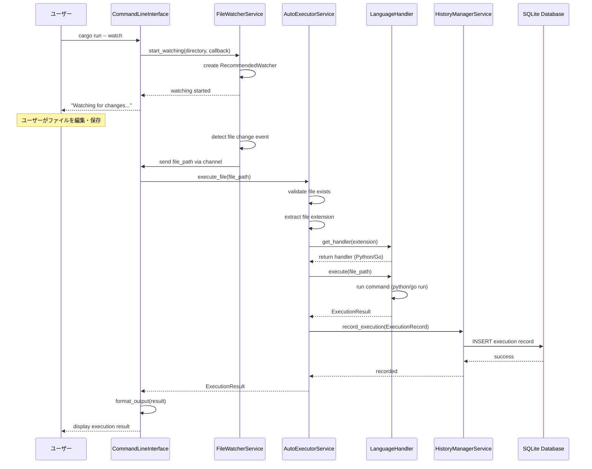
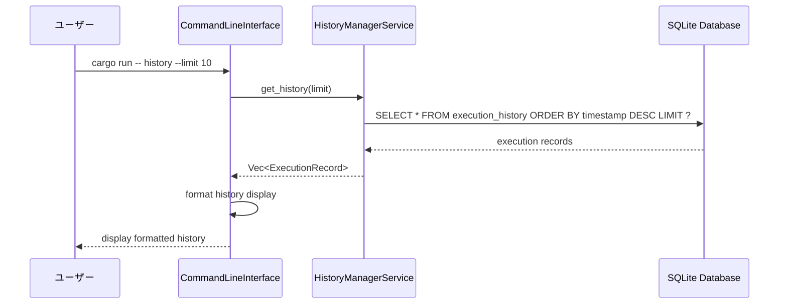
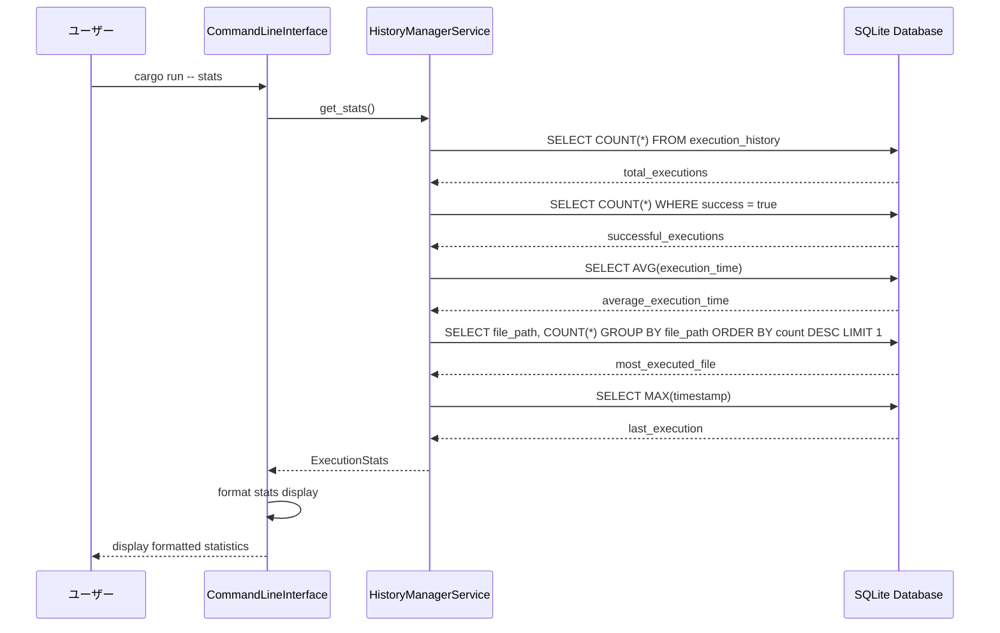
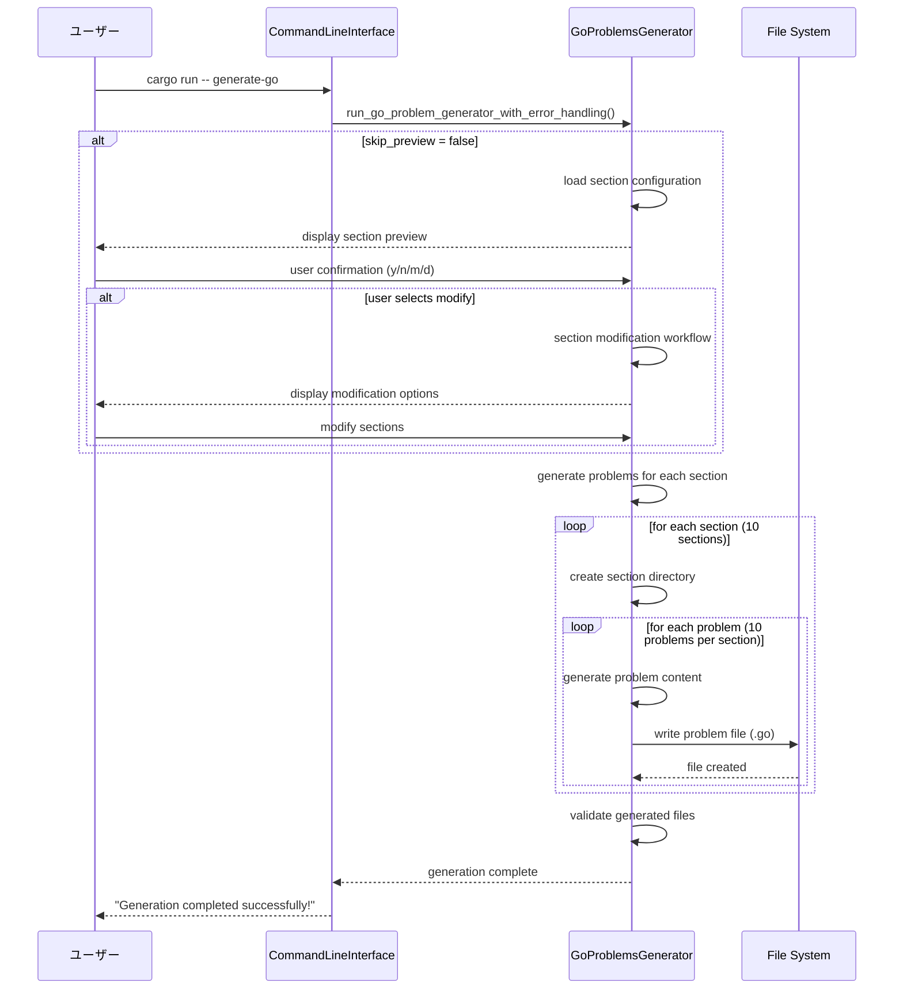
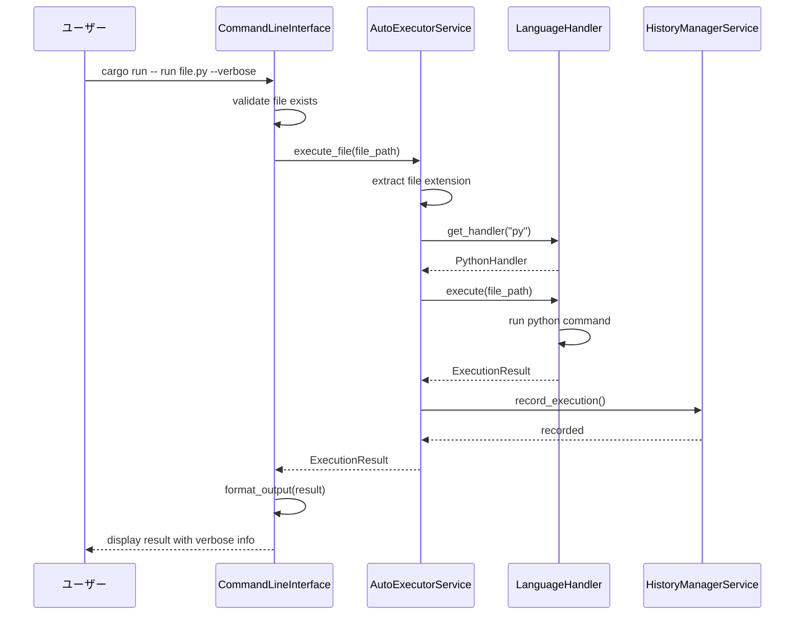

# シーケンス図

## 1. ファイル監視・自動実行のシーケンス

```mermaid
sequenceDiagram
    participant User as ユーザー
    participant CLI as CommandLineInterface
    participant Watcher as FileWatcherService
    participant Executor as AutoExecutorService
    participant Handler as LanguageHandler
    participant History as HistoryManagerService
    participant DB as SQLite Database

    User->>CLI: cargo run -- watch
    CLI->>Watcher: start_watching(directory, callback)
    Watcher->>Watcher: create RecommendedWatcher
    Watcher-->>CLI: watching started
    CLI-->>User: "Watching for changes..."

    Note over User: ユーザーがファイルを編集・保存

    Watcher->>Watcher: detect file change event
    Watcher->>CLI: send file_path via channel
    CLI->>Executor: execute_file(file_path)
    
    Executor->>Executor: validate file exists
    Executor->>Executor: extract file extension
    Executor->>Handler: get_handler(extension)
    Handler-->>Executor: return handler (Python/Go)
    
    Executor->>Handler: execute(file_path)
    Handler->>Handler: run command (python/go run)
    Handler-->>Executor: ExecutionResult
    
    Executor->>History: record_execution(ExecutionRecord)
    History->>DB: INSERT execution record
    DB-->>History: success
    History-->>Executor: recorded
    
    Executor-->>CLI: ExecutionResult
    CLI->>CLI: format_output(result)
    CLI-->>User: display execution result
```

## 2. 履歴表示のシーケンス

```mermaid
sequenceDiagram
    participant User as ユーザー
    participant CLI as CommandLineInterface
    participant History as HistoryManagerService
    participant DB as SQLite Database

    User->>CLI: cargo run -- history --limit 10
    CLI->>History: get_history(limit)
    History->>DB: SELECT * FROM execution_history ORDER BY timestamp DESC LIMIT ?
    DB-->>History: execution records
    History-->>CLI: Vec<ExecutionRecord>
    CLI->>CLI: format history display
    CLI-->>User: display formatted history
```

## 3. 統計情報表示のシーケンス

```mermaid
sequenceDiagram
    participant User as ユーザー
    participant CLI as CommandLineInterface
    participant History as HistoryManagerService
    participant DB as SQLite Database

    User->>CLI: cargo run -- stats
    CLI->>History: get_stats()
    
    History->>DB: SELECT COUNT(*) FROM execution_history
    DB-->>History: total_executions
    
    History->>DB: SELECT COUNT(*) WHERE success = true
    DB-->>History: successful_executions
    
    History->>DB: SELECT AVG(execution_time)
    DB-->>History: average_execution_time
    
    History->>DB: SELECT file_path, COUNT(*) GROUP BY file_path ORDER BY count DESC LIMIT 1
    DB-->>History: most_executed_file
    
    History->>DB: SELECT MAX(timestamp)
    DB-->>History: last_execution
    
    History-->>CLI: ExecutionStats
    CLI->>CLI: format stats display
    CLI-->>User: display formatted statistics
```

## 4. Go問題生成のシーケンス

```mermaid
sequenceDiagram
    participant User as ユーザー
    participant CLI as CommandLineInterface
    participant Generator as GoProblemsGenerator
    participant FileSystem as File System

    User->>CLI: cargo run -- generate-go
    CLI->>Generator: run_go_problem_generator_with_error_handling()
    
    alt skip_preview = false
        Generator->>Generator: load section configuration
        Generator-->>User: display section preview
        User->>Generator: user confirmation (y/n/m/d)
        
        alt user selects modify
            Generator->>Generator: section modification workflow
            Generator-->>User: display modification options
            User->>Generator: modify sections
        end
    end
    
    Generator->>Generator: generate problems for each section
    
    loop for each section (10 sections)
        Generator->>Generator: create section directory
        
        loop for each problem (10 problems per section)
            Generator->>Generator: generate problem content
            Generator->>FileSystem: write problem file (.go)
            FileSystem-->>Generator: file created
        end
    end
    
    Generator->>Generator: validate generated files
    Generator-->>CLI: generation complete
    CLI-->>User: "Generation completed successfully!"
```

## 5. 単発実行のシーケンス

```mermaid
sequenceDiagram
    participant User as ユーザー
    participant CLI as CommandLineInterface
    participant Executor as AutoExecutorService
    participant Handler as LanguageHandler
    participant History as HistoryManagerService

    User->>CLI: cargo run -- run file.py --verbose
    CLI->>CLI: validate file exists
    CLI->>Executor: execute_file(file_path)
    
    Executor->>Executor: extract file extension
    Executor->>Handler: get_handler("py")
    Handler-->>Executor: PythonHandler
    
    Executor->>Handler: execute(file_path)
    Handler->>Handler: run python command
    Handler-->>Executor: ExecutionResult
    
    Executor->>History: record_execution()
    History-->>Executor: recorded
    
    Executor-->>CLI: ExecutionResult
    CLI->>CLI: format_output(result)
    CLI-->>User: display result with verbose info
```