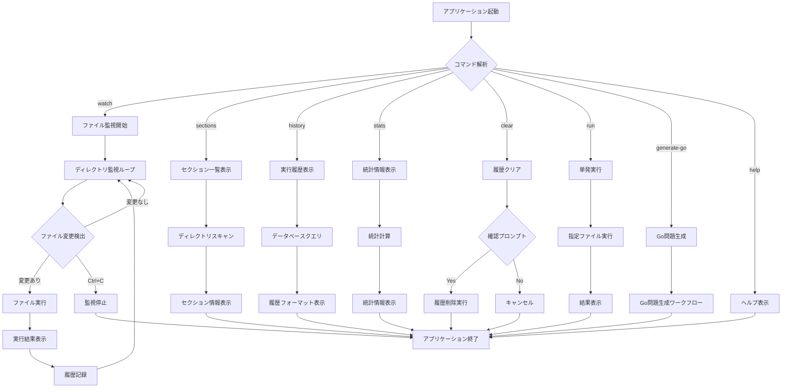
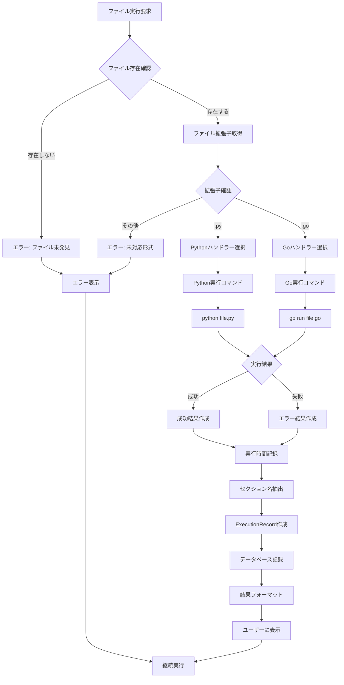
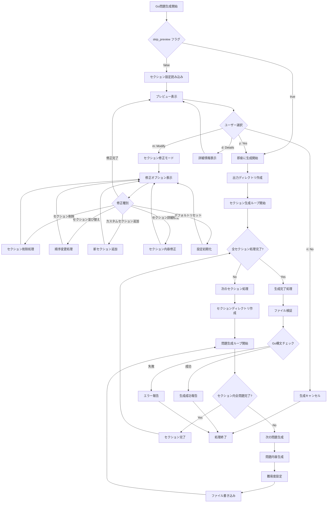
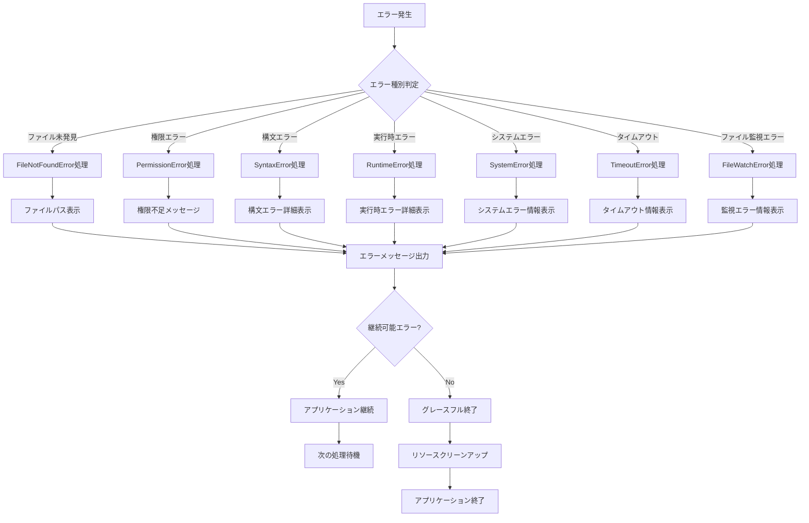

# ワークフロー図

## 1. アプリケーション全体のワークフロー



## 2. ファイル実行ワークフロー



## 3. データベース操作ワークフロー

```mermaid
flowchart TD
    A[データベース操作要求] --> B{操作種別}
    
    B -->|記録| C[execution_history INSERT]
    B -->|履歴取得| D[履歴SELECT クエリ]
    B -->|統計取得| E[統計計算クエリ群]
    B -->|履歴削除| F[DELETE クエリ]
    
    C --> G[実行記録をINSERT]
    G --> H{INSERT成功}
    H -->|成功| I[記録完了]
    H -->|失敗| J[エラーログ出力]
    
    D --> K[ORDER BY timestamp DESC]
    K --> L{LIMIT指定}
    L -->|あり| M[LIMIT N適用]
    L -->|なし| N[全件取得]
    M --> O[結果返却]
    N --> O
    
    E --> P[COUNT(*) 総実行数]
    P --> Q[COUNT(*) WHERE success=true 成功数]
    Q --> R[AVG(execution_time) 平均時間]
    R --> S[GROUP BY file_path 最多実行ファイル]
    S --> T[MAX(timestamp) 最終実行時刻]
    T --> U[統計オブジェクト作成]
    U --> V[統計結果返却]
    
    F --> W{force フラグ}
    W -->|true| X[即座に削除実行]
    W -->|false| Y[確認プロンプト表示]
    Y --> Z{ユーザー確認}
    Z -->|Yes| X
    Z -->|No| AA[削除キャンセル]
    X --> BB[DELETE FROM execution_history]
    BB --> CC[削除完了]
    
    I --> DD[処理完了]
    J --> DD
    O --> DD
    V --> DD
    AA --> DD
    CC --> DD
```

## 4. Go問題生成ワークフロー



## 5. エラーハンドリングワークフロー

